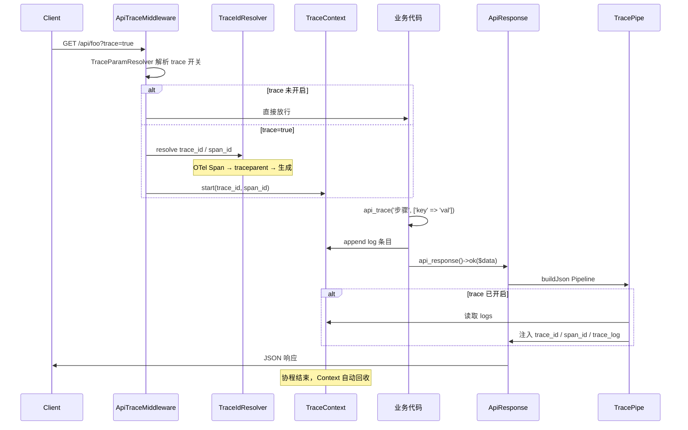
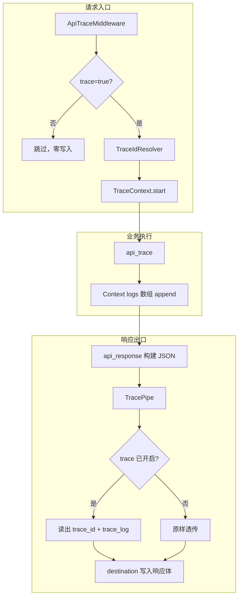

# 请求级 Trace 调试（trace_log）

当入参携带 `trace=true` 时，API 响应会在顶层额外输出 `trace_id`、`span_id`（可选）与 `trace_log`，用于排查单次请求内的业务执行过程。

相关文档：

- [API 响应使用说明](api-response.md)
- [性能压测指南](api-response-benchmark.md)
- [生产配置模板](api-response-production-template.md)

## 1. 功能概述

| 能力 | 说明 |
|------|------|
| 触发方式 | Query 或 Body 中 `trace=true` / `trace=1` |
| `trace_id` | 与 OpenTelemetry TraceId 对齐（32 位小写 hex） |
| `span_id` | 有 OTel 上下文或 `traceparent` 头时输出（16 位 hex） |
| `trace_log` | 有序调试日志，由业务代码通过 `api_trace()` 写入 |
| 存储 | 请求级 Hyperf Context 内存数组（无 Redis） |

**注意**：`trace_log` 是业务调试流水，与 `error.trace`（异常堆栈）语义不同。

## 2. 端到端执行流程

### 2.1 时序图



### 2.2 组件职责



### 2.3 `api_response()` 与 trace 的关系

正常成功 / 失败响应：

```
api_response()->ok() / failed() / json()
  → buildJson()
    → Pipeline: MessagePipe → ErrorPipe → TracePipe
      → destination(): 输出 status/code/message/data/error + trace 字段
```

异常响应：

```
api_response()->exception($throwable)
  → exception_pipes → buildJson() → 同上 Pipeline（含 TracePipe）
```

因此：**只要 trace 已开启，成功、失败、异常路径都会带上 `trace_id` 与 `trace_log`**。

## 3. 响应结构

### 3.1 未带 trace

与常规响应完全一致，不出现 `trace_id` / `span_id` / `trace_log`。

### 3.2 带 `trace=true`

```json
{
  "status": true,
  "code": 0,
  "message": "OK",
  "data": {"id": 1},
  "trace_id": "4bf92f3577b34da6a3ce929d0e0e4736",
  "span_id": "00f067aa0ba902b7",
  "trace_log": [
    {
      "t": "2026-06-29 12:34:56.123",
      "msg": "查用户",
      "ctx": {"user_id": 1}
    }
  ]
}
```

| 字段 | 说明 |
|------|------|
| `trace_id` | OpenTelemetry 兼容 TraceId（32 hex） |
| `span_id` | 可选；有 OTel / traceparent 时出现 |
| `trace_log` | 有序数组；无 `api_trace()` 调用时为 `[]` |
| `trace_log[].t` | 时间戳，包内自动生成 |
| `trace_log[].msg` | 调试说明（非空字符串） |
| `trace_log[].ctx` | 附加数据（数组，默认 `[]`） |

失败 / 异常时 `trace_log` 可与 `error` 字段共存。

## 4. 使用方式

### 4.1 发起请求

Query：

```http
GET /api/users/1?trace=true
```

Body（JSON）：

```http
POST /api/users
Content-Type: application/json

{"name": "foo", "trace": true}
```

认定为开启的值：`true`、`"true"`、`"1"`、`1`。

入参名默认为 `trace`，可通过 `API_RESPONSE_TRACE_PARAM` 修改（例如设为 `_debug` 后使用 `?_debug=true`）。

### 4.2 业务写日志

```php
public function show(int $id)
{
    api_trace('进入 show', ['id' => $id]);

    $user = $this->userService->find($id);
    api_trace('查询完成', ['found' => $user !== null]);

    return api_response()->ok($user);
}
```

### 4.3 中间件

包通过 `ConfigProvider` 默认注册 `ApiTraceMiddleware` 到 `middlewares.http`。

若项目接入了 OpenTelemetry，建议将 OTel 中间件放在本中间件**之前**，以便复用已有 Span 的 trace_id：

```php
// config/autoload/middlewares.php
return [
    'http' => [
        \Hyperf\OpenTelemetry\Middleware\TraceMiddleware::class, // 项目侧 OTel
        \FeloZ\HyperfApiResponse\Middleware\ApiTraceMiddleware::class,
        // ...
    ],
];
```

## 5. trace_id 与 OpenTelemetry

`trace_id` 获取优先级：

```text
1. OpenTelemetry 当前 Span 的 TraceId（已安装 OTel SDK 且上下文有效）
2. 请求头 traceparent 解析（W3C Trace Context）
3. 按 OTel 规则生成（random_bytes → 32 hex，排除全 0）
```

`span_id` 获取优先级：

```text
1. OpenTelemetry 当前 Span 的 SpanId
2. traceparent 头中的 span-id
```

可选 Composer 建议包（非必须）：

- `open-telemetry/opentelemetry`
- `hyperf/opentelemetry`

未安装 OTel 时，仍可使用 `traceparent` 或自动生成，格式与 OTel 一致，后续接入无需迁移 ID 策略。

## 6. 配置

```php
// config/autoload/api-response.php
'trace' => [
    // 总开关；false 时 Middleware 与 api_trace() 均不生效
    'enabled' => (bool) env('API_RESPONSE_TRACE_ENABLED', true),

    // 入参名（query + body），可通过 API_RESPONSE_TRACE_PARAM 覆盖
    'param' => env('API_RESPONSE_TRACE_PARAM', 'trace'),

    // 单请求 api_trace() 最大条数，超出后静默丢弃
    'max_entries' => (int) env('API_RESPONSE_TRACE_MAX_ENTRIES', 100),
],
```

`pipes` 默认包含 `TracePipe`（位于 `ErrorPipe` 之后）：

```php
'pipes' => [
    MessagePipe::class,
    ErrorPipe::class,
    TracePipe::class,
],
```

环境变量：

```env
API_RESPONSE_TRACE_ENABLED=true
API_RESPONSE_TRACE_PARAM=trace
API_RESPONSE_TRACE_MAX_ENTRIES=100
```

## 7. 性能影响

### 7.1 未开启 trace（无参数或 `trace=false`）

每请求仅多走 Middleware 参数判断 + TracePipe 一次 `isEnabled()` 检查，通常为**微秒级**，可忽略。

设 `API_RESPONSE_TRACE_ENABLED=false` 可进一步跳过 Middleware 内的参数解析。

### 7.2 开启 `trace=true`（参考微基准，swoole-cli）

以下为纯 PHP 逻辑耗时（不含 DB / 外部 IO），供量级参考：

| 场景 | 约耗时 | 相对无 trace |
|------|--------|-------------|
| Middleware（生成 trace_id） | ~8 µs | +4 µs |
| Middleware（解析 traceparent） | ~10 µs | +6 µs |
| `ok()` + 空 `trace_log` | ~12 µs | +1 µs |
| `ok()` + 5 次 `api_trace`（小 ctx） | ~35 µs | +24 µs |
| `ok()` + 20 次 `api_trace` | ~77 µs | +66 µs |
| `ok()` + 50 次 `api_trace` | ~175 µs | +165 µs |

相对一次含 DB 的 API（通常毫秒级），**只开 trace、少写日志时影响 < 0.2%**。

### 7.3 主要可变因素

1. **`api_trace()` 调用次数**：每条日志涉及时间戳生成与 Context 数组写入，条数越多 CPU 越高。
2. **`ctx` 体积**：大对象会拖慢内存拷贝与 `json_encode`。
3. **响应体大小**：20 条小日志约增加 ~1 KB JSON；`ctx` 过大时网络传输也更慢。

### 7.4 使用建议

- 仅在排查问题时开启 `trace=true`，不要作为常规入参。
- `ctx` 只放关键标量（id、耗时、状态码），避免塞完整 SQL 结果或大数组。
- 生产环境若完全不用：`API_RESPONSE_TRACE_ENABLED=false`。
- `trace=true` 会把内部信息返回给客户端，生产开放前请评估安全风险。

## 8. HTTP 压测（wrk）

完整步骤见 [性能压测指南](api-response-benchmark.md#trace-压测)。

### wrk 需要安装 PHP 扩展吗？

**不需要。** `wrk` 是独立的 HTTP 压测命令行工具（C 语言编写），与 PHP / Swoole 扩展无关。只需在压测机器上单独安装：

```bash
# macOS
brew install wrk

# Debian / Ubuntu
sudo apt install wrk
```

压测的是已启动的 Hyperf HTTP 服务（Hyperf 侧仍需 Swoole 等运行时）。

### 对比示例

```bash
# 基线：无 trace
wrk -t4 -c100 -d30s --latency "http://127.0.0.1:9501/api/__bench__/ok"

# 实验：带 trace=true
wrk -t4 -c100 -d30s --latency "http://127.0.0.1:9501/api/__bench__/ok?trace=true"
```

压测路由示例：

```php
Router::get('/api/__bench__/ok', static function () {
    api_trace('bench', ['t' => time()]);
    return api_response()->ok(['ping' => 'pong']);
});
```

## 9. 边界与限制

| 场景 | 行为 |
|------|------|
| HTTP 204 / 205 | 无响应 body，`trace_log` 无法返回 |
| 子协程 `go()` 未 `Context::copy()` | 子协程内 `api_trace()` 可能丢失 |
| `api_trace('')` 或纯空白 msg | 忽略，不计入 |
| 超过 `max_entries` | 后续 `api_trace()` 静默丢弃 |
| 非 `api_response()` 构造的响应 | 不注入 trace 字段 |

子协程内写 trace 示例：

```php
use Hyperf\Context\Context;
use Hyperf\Coroutine\go;

go(function () {
    Context::copy();
    api_trace('子协程内', []);
});
```

## 10. 相关源码

| 类 / 函数 | 路径 |
|-----------|------|
| `api_trace()` | `src/helpers.php` |
| `ApiTraceMiddleware` | `src/Middleware/ApiTraceMiddleware.php` |
| `TracePipe` | `src/Support/Pipes/TracePipe.php` |
| `TraceContext` | `src/Support/Trace/TraceContext.php` |
| `TraceIdResolver` | `src/Support/Trace/TraceIdResolver.php` |
| `TraceParamResolver` | `src/Support/Trace/TraceParamResolver.php` |
